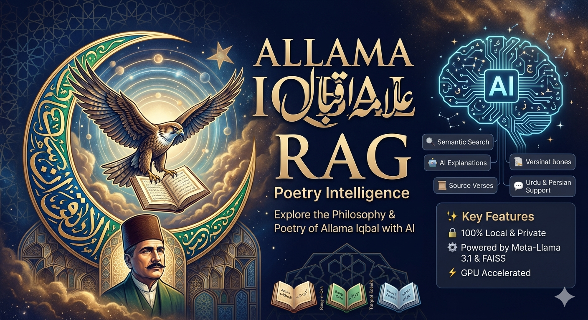

<div align="center">

# 🌙 Allama Iqbal RAG — Poetry Intelligence

### *Explore the Philosophy & Poetry of Allama Iqbal with AI*
[](https://python.org)
[](https://langchain.com)
[](https://faiss.ai)
[](https://ollama.com)
[](https://gradio.app)
[](LICENSE)
<br>

> *"Tu shaheen hai, parwaz hai kaam tera — tere saamne aasmaan aur bhi hain"*
> — Allama Muhammad Iqbal

<br>

A fully **local, private AI** app to **search, understand, and analyze** the poetry of Allama Iqbal using **Retrieval-Augmented Generation (RAG)**. Ask about *Khudi*, *Shaheen*, *Ishq*, or any philosophical theme — and receive deep, scholarly explanations grounded in Iqbal's own verses.

**25,595 verses** indexed. Fully offline. No API keys. No data sent anywhere.

</div>

---

## ✨ Features

- 🔍 **Semantic Search** — Find relevant verses across all of Iqbal's books using multilingual embeddings
- 🤖 **AI Explanations** — Meta-Llama 3.1 8B explains meaning, symbolism, and philosophy via Ollama
- 📜 **Source Verses Panel** — See exactly which verses were retrieved to generate the answer
- 💬 **Urdu & Persian Support** — Ask questions in English, Urdu, or Persian
- 🎭 **Sample Questions** — 8 ready-made questions to explore Iqbal's themes
- ⚡ **GPU Accelerated** — Embeddings on CUDA, LLM on Ollama (RTX 4060 Ti tested)
- 🔒 **100% Local & Private** — Runs entirely on your machine
- 🔒 **This project also supports GGUF models via llama.cpp.
---

## 🖼️ App Preview

```
╔══════════════════════════════════════════════════════════╗
║              ☽  Wisdom of the East                       ║
║          حکیمِ الامت — علامہ محمد اقبال                  ║
╠══════════════════════════════════════════════════════════╣
║  🖼️ Portrait         │  ✦ Scholarly Response             ║
║                      │  ─────────────────────            ║
║  ✦ Your Question     │  AI explanation of the            ║
║  ─────────────────   │  verse/theme with depth           ║
║  [Ask anything...]   │  and scholarly insight…           ║
║                      │                                   ║
║  [✦ Seek Wisdom ✦]   │  📜 Retrieved Source Verses       ║
║                      │  • verse 1                        ║
║  ✦ Sample Questions  │  • verse 2                        ║
║  • Khudi?            │  • verse 3                        ║
║  • Shaheen?          │                                   ║
╚══════════════════════════════════════════════════════════╝
```

---

## 🗂️ Project Structure

```
allama-iqbal-rag/
│
├── iqbal_scholar.py              # 🚀 Main Gradio app (RAG + Ollama + UI)
├── iqbal_original_verses.txt     # 📚 25,595 verses from Iqbal's complete works
├── Allama-Iqbal-2.jpg            # 🖼️ Portrait image
├── README.md                     # 📖 This file
│
└── iqbal_index/                  # 📦 FAISS vector index (auto-generated on first run)
    ├── index.faiss
    └── index.pkl
```

---

## ⚙️ Requirements

| Component | Requirement |
|-----------|-------------|
| Python | 3.10 or higher |
| Ollama | Latest (https://ollama.com) |
| GPU | NVIDIA CUDA recommended |
| RAM | 8 GB minimum |
| VRAM | 6 GB+ for GPU inference |
| Model | Meta-Llama-3.1-8B-Instruct Q4_K_M GGUF |

---

## 🚀 Installation & Setup

### Step 1 — Clone the repository

```bash
git clone https://github.com/Khurramcoder/allama-iqbal-rag.git
cd allama-iqbal-rag
```

### Step 2 — Install Python dependencies

```bash
pip install gradio langchain langchain-community langchain-huggingface
pip install faiss-cpu sentence-transformers
```

### Step 3 — Install Ollama

Download and install from: **https://ollama.com/download/windows**

Ollama runs as a background service automatically after installation.

### Step 4 — Download the GGUF Model

Download **Meta-Llama-3.1-8B-Instruct-Q4_K_M.gguf** from HuggingFace:

👉 [Meta-Llama-3.1-8B-Instruct-GGUF on HuggingFace](https://huggingface.co/bartowski/Meta-Llama-3.1-8B-Instruct-GGUF)

Save it to: `D:\Langchain_RAG\Meta-Llama-3.1-8B-Instruct-Q4_K_M.gguf`

### Step 5 — Register the model with Ollama (one-time)

Run this in PowerShell:

```powershell
@"
FROM D:\Langchain_RAG\Meta-Llama-3.1-8B-Instruct-Q4_K_M.gguf
PARAMETER temperature 0.35
PARAMETER num_predict 600
"@ | Out-File -FilePath "D:\Langchain_RAG\Modelfile" -Encoding utf8

ollama create iqbal-llama -f D:\Langchain_RAG\Modelfile
```

### Step 6 — Run the app

```bash
python iqbal_scholar.py
```

Open your browser at: **http://localhost:7860**

> The FAISS index builds automatically on first run and is saved to `iqbal_index/` for instant loading next time.

---

## 💡 Example Questions

| Question | Language | Mode |
|----------|----------|------|
| What is Iqbal's concept of Khudi (Selfhood)? | English | Philosophy |
| Explain the significance of Shaheen (Eagle). | English | Symbolism |
| اقبال کے کلام میں خودی کا کیا مفہوم ہے؟ | Urdu | Philosophy |
| شکوہ اور جوابِ شکوہ کا مرکزی خیال کیا ہے؟ | Urdu | Poetry |
| How does Iqbal compare Ishq (Love) and Aql (Reason)? | English | Comparative |
| What is Faqr (spiritual poverty) in Iqbal's philosophy? | English | Spirituality |
| Explain Iqbal's vision of Mard-e-Momin. | English | Philosophy |

---

## 🧠 How It Works

```
User Query (English / Urdu / Persian)
         │
         ▼
Multilingual Embeddings       ← sentence-transformers MiniLM-L12 (CUDA)
         │
         ▼
FAISS Semantic Search         ← Top-3 most relevant verses retrieved
         │
         ▼
Prompt = System + Context + Query
         │
         ▼
Ollama → Meta-Llama 3.1 8B   ← Local GGUF, GPU accelerated
         │
         ▼
Scholarly Answer displayed in Gradio UI
```

---

## 📚 Iqbal's Works Included

| Book | Language | Theme |
|------|----------|-------|
| Asrar-e-Khudi | Persian | Secrets of the Self |
| Rumuz-e-Bekhudi | Persian | Mysteries of Selflessness |
| Bang-e-Dra | Urdu | Call of the Bell |
| Bal-e-Jibril | Urdu | Gabriel's Wing |
| Zarb-e-Kaleem | Urdu | Moses's Rod |
| Armughan-e-Hijaz | Urdu/Persian | Gift of Hijaz |
| Payam-e-Mashriq | Persian | Message of the East |

---

## 🛠️ Configuration

Edit these variables at the top of `iqbal_scholar.py`:

```python
BASE_DIR     = r"E:\allama-iqbal.com-main"   # folder with verses + image
INDEX_DIR    = os.path.join(BASE_DIR, "iqbal_index")  # FAISS index folder
OLLAMA_MODEL = "iqbal-llama"                 # name you gave in ollama create
OLLAMA_URL   = "http://localhost:11434/api/generate"
TOP_K        = 3    # number of verses to retrieve per query
```

---

## ❓ Troubleshooting

| Problem | Solution |
|---------|----------|
| `Ollama not running` | Run `ollama serve` in a terminal |
| `model not found` | Run `ollama create iqbal-llama -f D:\Langchain_RAG\Modelfile` |
| Slow responses | Normal on CPU — GPU inference via Ollama is much faster |
| Index not found | Delete `iqbal_index/` folder and restart — it rebuilds automatically |

---

## 👤 Author

**Khurram Pervez**
GitHub: [@Khurramcoder](https://github.com/Khurramcoder)

---

## 🤝 Contributing

Pull requests are welcome! For major changes, please open an issue first to discuss.

---

## 📄 License

This project is licensed under the MIT License. Iqbal's poetry is in the public domain.

---

<div align="center">

*Built with ❤️ for the lovers of Iqbal's philosophy*

**اٹھو مری دنیا کے غریبوں کو جگا دو**
**کاخِ امرا کے در و دیوار ہلا دو**

</div>
